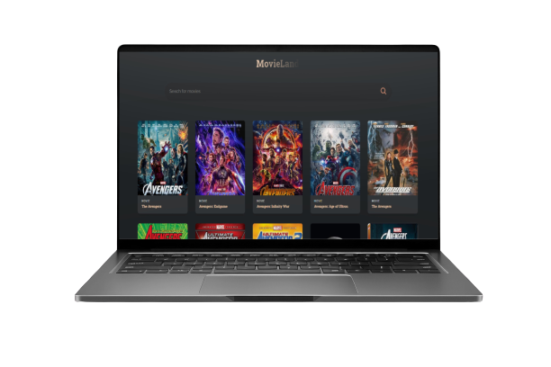

# My First React Movie App 🎬

Welcome to my first React project - a movie app that lets you search for movies using an API.

Project website: [Movie App](https://mizzath2003.github.io/MovieApp/)

## Overview

This React-based movie app allows users to:
- **Search Movies:** Explore a vast collection of movies by entering keywords.
- **API Integration:** Utilizes a movie API to fetch and display movie data.

## Technology Stack

- **Frontend:** React Js
- **API Integration:** Axios or Fetch API

## Features

- **Search Movies:** Enter movie names or keywords to find relevant movies.
- **Responsive Design:** Ensures a seamless experience across devices.

## API Integration

This app connects to a movie API to fetch data. Make sure to acquire an API key and replace it in the code's API request section.

## Getting Started

To run the app locally:
1. Clone this repository.
2. Install dependencies using `npm install`.
3. Run the app using `npm start`.
4. Explore the movie search functionality in your browser.
